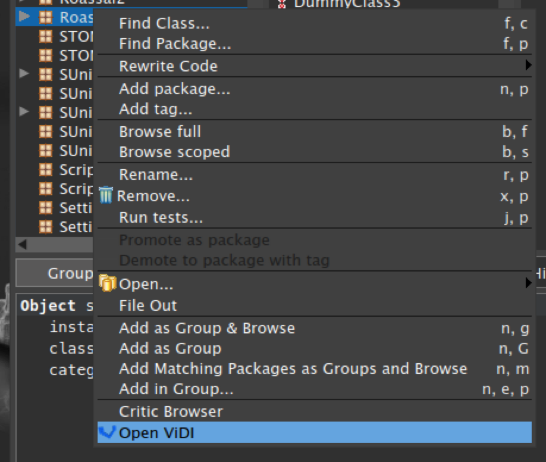

Vidi 
====

Download [latest version for Pharo4 from CI server](https://ci.inria.fr/pharo-contribution/job/Vidi/PHARO=40,VERSION=development,VM=vm/lastSuccessfulBuild/artifact/Vidi.zip).

Or execute in your image:

    Gofer new
      smalltalkhubUser: 'YuriyTymchuk'
      project: 'Configuration';
      configurationOf: 'Vidi';
      load.
    #ConfigurationOfVidi asClass loadDevelopment

How to use:
-----------
Just right-click on your package in Nautilus and select "Run Vidi"

More:
-----

V̲i̲sual d̲esign i̲nspector with a block flavour

Colors: `#33aaff` `#ff8833`
