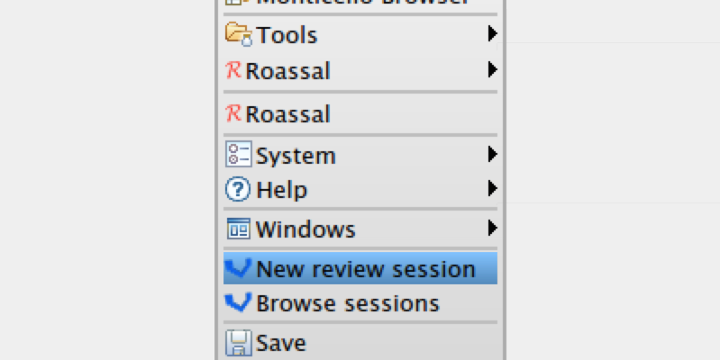

Vidi 
====

Download [latest version for Pharo4 from CI server](https://ci.inria.fr/pharo-contribution/job/Vidi/PHARO=40,VERSION=development,VM=vm/lastSuccessfulBuild/artifact/Vidi.zip).

Or execute in your image:

    Gofer new
      smalltalkhubUser: 'YuriyTymchuk'
      project: 'Configuration';
      configurationOf: 'Vidi';
      load.
    #ConfigurationOfVidi asClass loadStable

How to use:
-----------
From world menu select _New review session_, add packages that you want to review and proceed to the next step. ViDI will check selected packages with Smalllint rules and display the reviewing interface.

Review sessions can be browsed by selecting _Browse sessions_ form the world menu. A [GTInspector](http://gt.moosetechnology.org) showing the list of session will open. Each session's view also provides graphs about review activity. Events on the graphs can be selected to view additional information about them such as diffs. Also each session allows user to reopen review window and to stop the session for the actions displayed with the icons in the top right corner of the session view (in the inspector).

More:
-----

V̲i̲sual d̲esign i̲nspector with a block flavor

Colors: `#33aaff` `#ff8833`
(this colors are wrong, in 3D everything changes because of lights and shadows)
